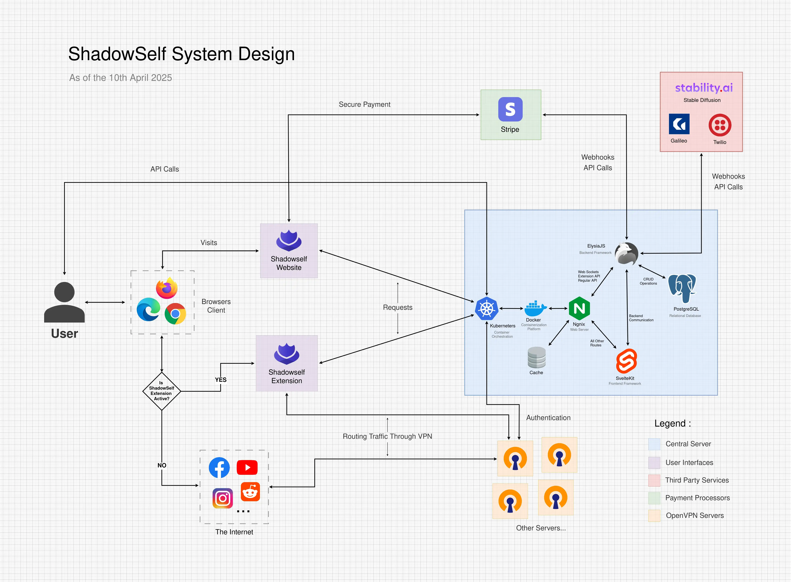

  <picture>
    <source media="(prefers-color-scheme: dark)" srcset="./application/frontend/src/lib/images/brand/logo-white-text.svg">
    
  </picture>

## ShadowSelf Overview

[ShadowSelf](https://shadowself.io) is a web application that allows any individual to safeguard their privacy and anonymity in the digital age. With it, you can generate synthetic identities, complete with functional phone numbers, crypto wallets, email addresses, proxies and even more personalizable attributes.

By utilizing such fabricated identities, you can register for online services while concealing you true identity, offering a significant step toward protecting you privacy & right to remain anonymous online.

## Quick Headup

We encourage you to explore the codebase and contribute to areas you're comfortable with, especially if you have the skills to improve upon existing features or address bugs.

However, please be aware that certain core components and administrative modules are primarily intended for setup and ongoing management only by the project maintainer. These sections are integral, complex and are generally not designed for modification by all contributors.

If you're looking for areas to contribute, focusing on other parts of the application would be most beneficial.

## Running Locally

### Requirements

- `Bun` : Serves as the JavaScript runtime, dependency manager, and bundler for the web servers.

- `Nginx` : Employed as a reverse proxy for efficient request routing.

- `PostgreSQL` : Utilized as the primary database, configured to support backend operations.

- `OpenVPN` : Functions as the proxy node for secure outbound connections.

- `Squid` : Acts as the HTTPS proxy server, providing access to the OpenVPN network.

### Application

To run the application locally with Docker, execute `docker-compose up --build`. Note that this requires all necessary configuration files and environment variables to be correctly set up beforehand.

Alternatively, if you prefer a non-Docker setup, instructions are provided below.

#### Frontend

- `bun install` To install all the dependencies

- `bun dev` To start the development server

- `bun run build` To build the project

- `bun preview` To preview the project locally

- `bun start` To start a production-ready server

#### Backend

- `bun install` To install all the dependencies

- `psql -U postgres -f tables.sql` To initialize the database

- `bun dev` To start the development backend server

- `bun run build` To build and compile the project

- `./server` To start a production-ready server

### Proxy Node

The proxy services can be orchestrated using `docker-compose up --build`. however, this method requires that all necessary environment variables and specific configurations are correctly in place for proper functionality.

For direct development or setup of individual components, please refer to the manual instructions below.

- `bun install` To install all necessary dependencies.

- `bun dev` To start the development server.

- `bun run build` To build the project for production.

- `./proxy` To start the production-ready server.

- `squid -f squid.conf` To start the Squid proxy server using the squid.conf configuration file.

- `openvpn --config server.conf` To start the OpenVPN server and associated PKI infrastructure.

### Browser Extension

To set up the browser extension, navigate to its directory. Based on your browser, rename the appropriate manifest file to manifest.json. Then, go to your browser's extension settings, enable developer mode, and use the "load unpacked" option to select the extension's directory.

### Linting/Formatting

- `bun install` To install both eslint and prettier (project root)

- `bun lint` To run the linter on the project

- `bun format` To run the code formatter

### Quick Tmux Session

To quickly spawn a `tmux` session with all servers running and other relevant processes, follow these steps:

- `cd .scripts` To navigate to the scripts directory.
- `chmod +x tmux-session.sh` To make the `tmux-session` script executable.
- `bash tmux-session.sh` To run the script and start the `tmux-session` session.

## Contribution

If you'd like to contribute, please [open an issue](https://github.com/RedeemedSpoon/ShadowSelf/issues) or [open a pull request](https://github.com/RedeemedSpoon/ShadowSelf/pulls).

Also checkout the [CONTRIBUTING.md](/CHANGELOG.md) file for more information on how to contribute.

Here is the project system design if that might help you understand the architecture of the project better:

## License

This project is licensed under the GNU Affero General Public License v3.0 (AGPL-3.0). This license allows you to use, modify, and distribute this project under its terms. To view a copy of this license, visit [https://www.gnu.org/licenses/agpl-3.0.html](https://www.gnu.org/licenses/agpl-3.0.html).
