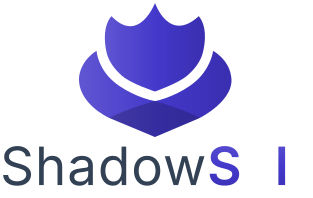

<picture>
  <source media="(prefers-color-scheme: dark)" srcset="./src/lib/dark-logo.svg">
  
</picture>

## ShadowSelf Overview

ShadowSelf is a web application that allows any individual to safeguard their privacy and anonymity in the digital age. With it, you can generate synthetic identities, complete with functional phone numbers, virtual cards, email addresses, proxies, metadata, names, nationalities and way more exciting stuff....

By utilizing such fabricated identities, you can register for online services while concealing you true identity, offering a significant step toward protecting you privacy & right to remain anonymous online.

This is not a perfect solution nor is it the most economical viable one, but it presents the perfect balance of convenience for the user and protection of sensitive data &.

## Running Locally

To get started, clone the repository with the following command:

```bash
git clone https://github.com/RedeemedSpoon/ShadowSelf.git
```

Change into the directory:

```bash
cd ShadowSelf
```

Install the dependencies:

```bash
bun install
```

Start the server:

```bash
bun dev
```

If you want to build the project and preview it locally, run the following command:

```bash
bun build
bun preview
```

## Contribution

If you'd like to contribute, please [open an issue](https://github.com/RedeemedSpoon/ShadowSelf/issues) or [open a pull request](https://github.com/RedeemedSpoon/ShadowSelf/pulls).

Refer to the [Contributing Guide](./CONTRIBUTING.md) for more information.

## License

This project is licensed under the GPL-3.0 License. This license allows you to use, modify, and distribute this project. To view a copy of this license, visit [https://www.gnu.org/licenses/gpl-3.0.html](https://www.gnu.org/licenses/gpl-3.0.html).
